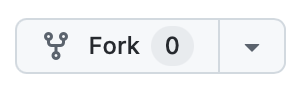
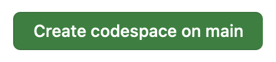
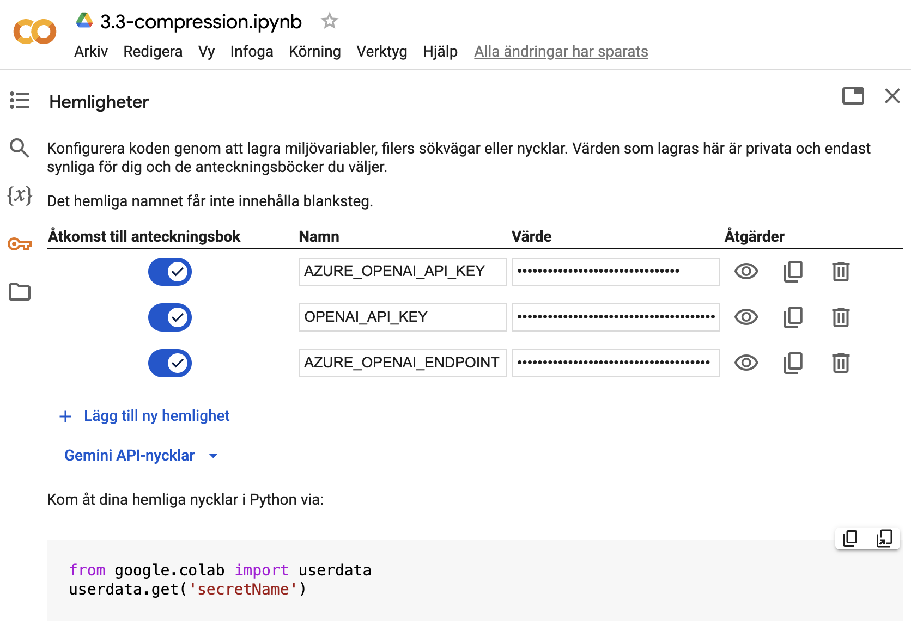
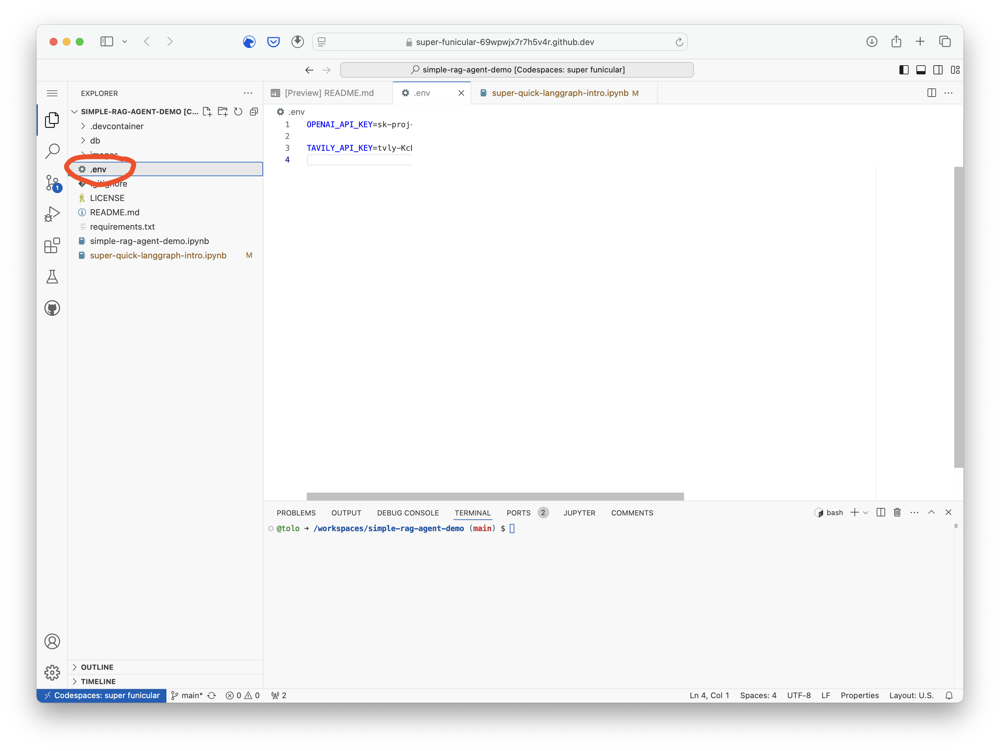
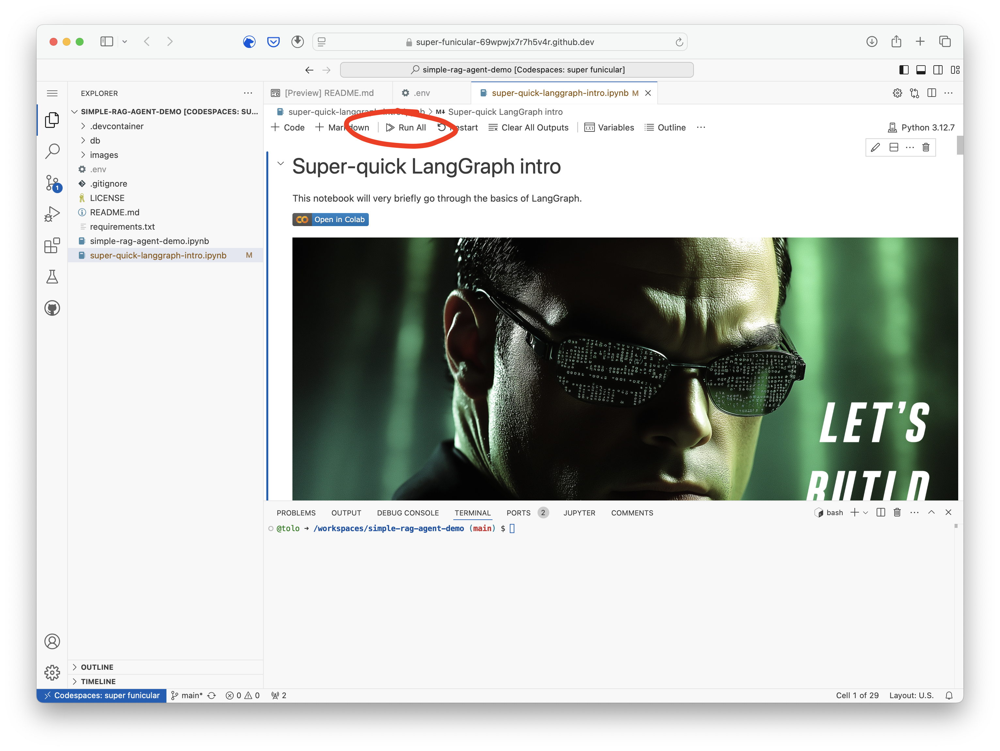
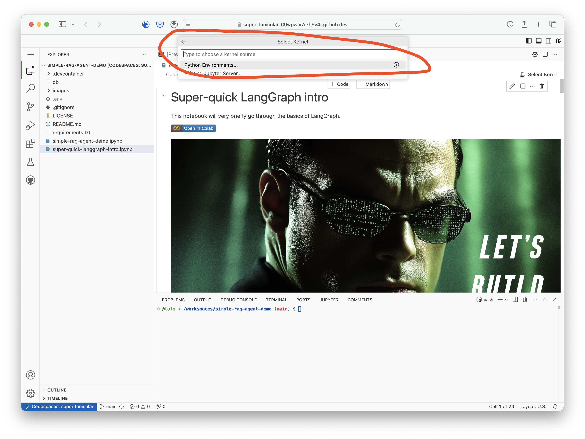
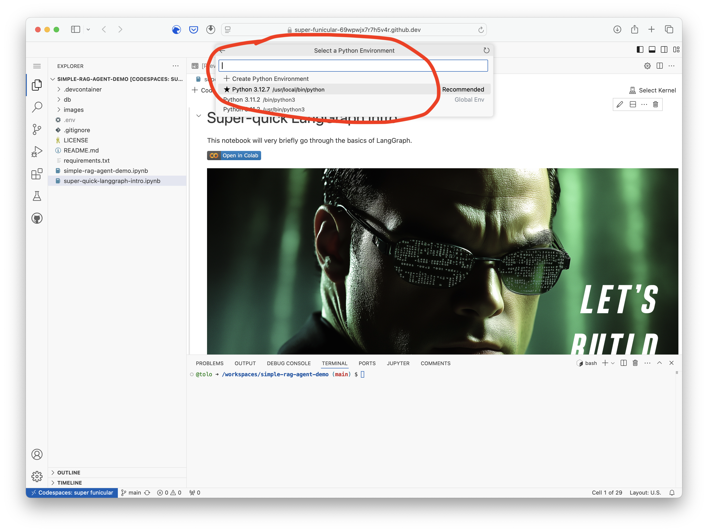

# Simple LangGraph intro and demo (_agentic_ RAG)


## Get started in 4 ways

1. **Use GitHub Codespaces - (requires a GitHub-account)**:
   - _(Optional first step if you want to save your changes: **Fork this repo**)_ <br/>
     
   
   - Click "Code" and then "Create codespace on main" in the GitHub UI<br/>
     <br/>
     
     <br/>
   
   - Wait for the codespace to be created and then create a `.env` file with the API-keys.
     (_**See below for screenshots**_)

2. **Use Google Colab (requires a Google account)**:
   - Click the corresponding _**`Open in Google Colab`**_ link below.
   - Configure "Secrets" / API-keys (reachable from the left-hand menu). 
      

3. **If you have a decently up-to-date local Pyton environment (3.11 or 3.12)**: 
   - Clone this repo 
   - Create a `.env` file with the API-keys.
   - Activate the virtual environment:
     ```bash
        python -m venv venv

        # On Windows:
        .\venv\Scripts\activate

        # On MacOS/Linux:
        source venv/bin/activate

        pip install -r requirements.txt
     ``` 

4. **If you have VS Code and Docker installed**:
   - Clone this repo
   - Create a `.env` file with the API-keys.
   - Open the repo in VS Code and add the Dev Containers extension if you don't have it already
   - Reopen in a [dev container](https://code.visualstudio.com/docs/devcontainers/tutorial)


## Jupyter Notebooks Golab links:

### Super-quick LangGraph into
<a target="_blank" href="https://colab.research.google.com/github/tolo/simple-rag-agent-demo/blob/main/super-quick-langgraph-intro.ipynb">
  
</a>

### Simple RAG agent demo
<a target="_blank" href="https://colab.research.google.com/github/tolo/simple-rag-agent-demo/blob/main/simple-rag-agent-demo.ipynb">
  
</a>


## Some useful links

### Custom ChatGPT assistant for Python
* https://chatgpt.com/g/g-cKXjWStaE-python

### LangChain
* Concepts: https://python.langchain.com/docs/concepts/
* Tutorials: https://python.langchain.com/docs/tutorials/
* Prompt hub: https://smith.langchain.com/hub

### LangGraph
* Glossary / concepts - https://langchain-ai.github.io/langgraph/concepts/low_level/
* Tutorials: https://langchain-ai.github.io/langgraph/tutorials/


## Codespace - setup

<br/>
<br/>
<br/>
<br/>
